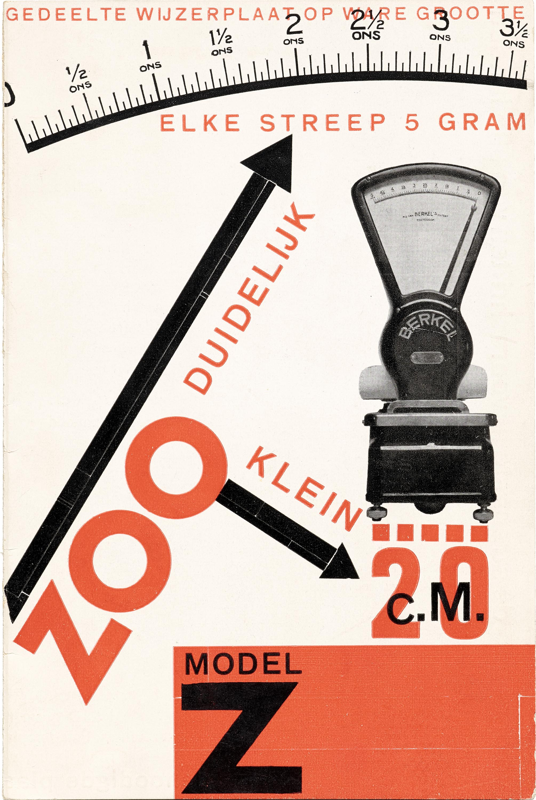
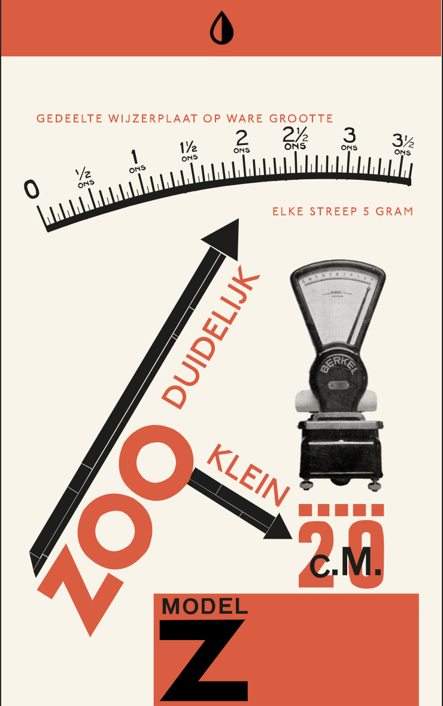

# Onderbouwing - Web-Animatie
---

## Inleiding
---
Voor het vak *Web-Animatie* mocht ik een flyer uitzoeken naar keuze en die animeren door gebruik te maken HTML, CSS en Javascript. <br>
Ik heb al enige ervaring met coderen omdat ik CMD doe, maar het was allemaal al weer een beetje weggezakt. Ik merkte wel dat het de laatste week steeds makkelijker ging, waardoor ik het weer leuk vond.

### Flyer
---
Na de eerste les kregen we links gestuurd met flyers waar we uit konden kiezen. Mijn oog viel eerst op een paar andere flyers, maar omdat die niet uitdagend genoeg waren voor het vak, heb ik gekozen voor deze flyer:

</img>
</img>

### Waarom deze Flyer?
---
Ik koos deze flyer, omdat ik vintage voorwerpen altjd erg interessant vind. Zo ook deze weegschaal. Ik denk ook dat deze flyer mij trok, omdat er nederlandse tekst op staat wat misschien herkenbaarheid in mij triggerde.

### Hoe is deze flyer ontstaan?
---
De flyer is gemaakt door een bekende grafische ontwerper Paul Schuitema. Hij werkte voor P. van Berkel, een worst- en vleeswarenfabriek. 
Hij heeft meerdere flyers voor dit bedrijf gemaakt, dus de gekozen flyer is er een uit velen. In dit geval maakte hij de flyer voor het *Berkel weegschaal model Z* dat net uitgekomen was rond 1929.
Er zijn flyers van hem te vinden van eerdere modellen. Hierin is over het algemeen dezelfde stijl te zien, maar er worden elke keer andere vormen gebruikt. In de flyer die ik heb gekozen zie je voornamelijk rechte vormen.
Paul Schuitema werkte vaak met diagonale lijnen, waardoor het oog bepaalde elementen van een flyer niet mist, omdat het oog die lijnen volgt.

### Animatie
---
De link naar mijn animatie: https://dorinereijersen.github.io/web-animatie/

De interacties die het bevat zijn het volgende:<br>
    • Als de pagina geopend wordt, zijn er twee pijlen die bewegen. Dit heb ik gedaan, omdat in het echt de pijl op de weegschaal naar rechts beweegt, zodra er gewicht op de schaal komt. <br>
    Ik heb dit gedaan door bij de lange pijl deze code neer te zetten:
    
    ```css
    svg #pijl polygon:first-child {
    animation: pijl 1s ease-in-out infinite alternate;
    transform-origin: bottom;
    }
    svg #pijl polygon {
    animation: pijltje 1s ease-in-out infinite alternate;
    transform-origin: bottom;
    }
```

```

Voor de kleinere pijl heb ik deze code hieronder gebruikt. Hier zie je dat de origin vanaf links draait, omdat het anders de verkeerde richting op gaat.

    ```css
    svg #pijl_klein polygon:last-child {
    animation: pijl .5s ease-in-out infinite alternate;
    transform-origin: left;
    }
    svg #pijl_klein polygon {
    animation: pijltje .5s ease-in-out infinite alternate;
    transform-origin: left;
    }
```
```

Voor de kleinere pijl heb ik deze code hieronder gebruikt. Hier zie je dat de origin vanaf links draait, omdat het anders de verkeerde richting op gaat.

<br>
    • De punten van de pijlen worden oranje als je er overheen hovert. Op mobiel kan je hier op klikken. <br>
    • Kleuren worden negatief als je op je toesenbord op Z drukt. De Z staat voor het type model van de weegschaal. Het leek mij leuk om dit zo uit te lichten.
    Deze interactie is ook op mobiel beschikbaar als er op de button bovenaan in de header geklikt wordt. Deze header is overigens niet op laptop beschikbaar, omdat je dan gebruik kan maken van het toetsenbord.<br>
    • Op de weegschaal kan gedrukt worden, dan worden de kleuren omgedraaid van de content. Dus het meetlint wordt bijvoorbeeld wit.<br>
    • De Z onderaan draait wanneer er overheen gehoverd wordt. Op mobiel kan je klikken op de Z.<br>
    • Ik wilde ook iets subtiels doen met het meetlint, maar ik wilde het niet te druk maken. 
    Als je op laptopformaat over het meetlint hovert, verkleuren de streepjes.
    
### Het vak Web-Animatie 
---
Ik heb dit vak als prettig ervaren. In het begin was ik bang dat de lat heel hoog zou liggen en dat ik niet veel van het coderen zou snappen, maar dat viel erg mee. Ik heb  al wat jaren heb gehad in coderen en de drempel van het vak lag niet heel hoog en ik vond de opdracht leuk om te doen, dus al met al viel het mij allemaal erg mee.
Het enige minpuntje wat ik heb is dat wij (als klas) 's ochtends om half negen aan het wachten waren tot de les begon en dat we wat laat pas een berichtje kregen dat het om negen uur begon. Dit had van mij wat eerder gecommuniceerd mogen worden, maar ik snap dat dat moeilijk was door de hele omstandigheid rondom corona.
